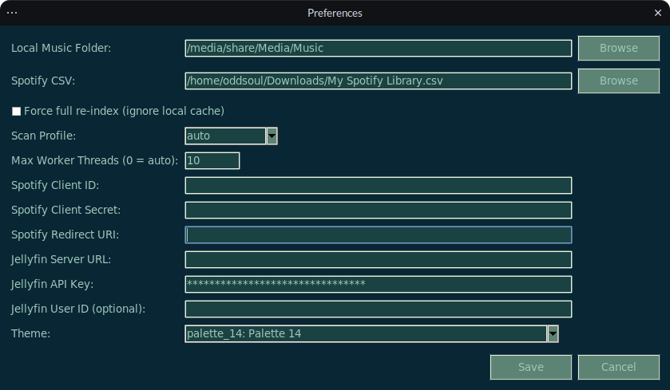
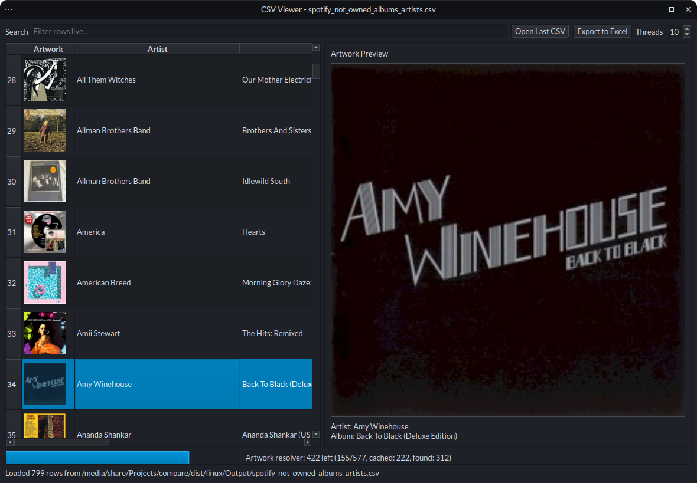

# Album Detective


Discover which albums you do not own across your online collections.

Album Detective is a desktop app for collectors who want to cross-reference local music against Spotify and Jellyfin data, then quickly review missing albums with artwork and export-ready results.

## Why use it

- Compare local library vs Spotify/Jellyfin in a collector-first workflow.
- Reduce false positives by normalizing common album variants like Remastered, Deluxe, and Special Edition.
- Review missing albums in a dedicated CSV Viewer with artwork preview and filtering tools.

## Core capabilities

- Read-only local scan with multi-threaded indexing.
- Incremental scan cache for faster repeat runs.
- Spotify CSV cleanup to app-compatible fields.
- Missing album detection using normalized artist/album keys.
- Source selection for compare runs: Local or Jellyfin.
- Progress + cancel support for long operations.
- Persistent settings and theme selection.

## Screenshot

### Main Menu


### Settings Menu



### CSV Viewer Window



## CSV Viewer

- Open from File -> View CSV in New Window.
- Sortable columns and live filtering.
- Open latest CSV quickly.
- Export visible rows to Excel.
- Row actions for opening album searches in Spotify/Jellyfin.
- Large 600x600 artwork preview panel on row selection.
- Artwork caching progress bar with cached vs resolver counts.
- Thread selector to tune resolver throughput.
- Cache-first artwork loading from:
  - ROOT/cache/artwork
  - ~/cache/artwork

## Runtime folder structure

When the app starts, it creates and uses this structure in the current run directory:

- ROOT/Config
- ROOT/Logs
- ROOT/Output

Persistent config file:

- ROOT/Config/settings.json

Log files:

- ROOT/Logs/diagnostic.log
- ROOT/Logs/error.log

## Paths used by default

- Local folder (OS-aware):
  Linux: `/media/share/Media/Music`, then `~/Music`, then `~/music`
  Windows: `~/Music`, then `~/OneDrive/Music`
- Spotify CSV: `~/Downloads/My Spotify Library.csv`
- Output folder: `ROOT/Output` (fixed)

You can change all of these in the UI.

## Quick start

```bash
cd /media/share/Projects/compare
python3 -m venv .venv
source .venv/bin/activate
pip install -r requirements.txt
```

## Run

```bash
python main.py
```

## Compare flow

1. Choose compare source (Local or Jellyfin).
2. Run compare against Spotify data.
3. Review generated outputs in ROOT/Output.
4. Open CSV Viewer to inspect missing albums with artwork.

## Spotify API Import

Use File -> Import -> From Spotify.

Before first import, open Settings -> Preferences and set:

- Spotify Client ID
- Spotify Client Secret
- Spotify Redirect URI (default: `http://127.0.0.1:8888/callback`)

Required Spotify app scopes used by this app:

- `user-library-read`
- `user-follow-read`

Import output is written to:

- `ROOT/Output/spotify_clean_tracks.csv`

The imported CSV uses the same format as the compare pipeline:

- `Track name,Artist,Album`

## Jellyfin + NAS Import Alternatives

Use menu: `File -> Import`

- `From Jellyfin`
  - Uses Jellyfin API key authentication.
  - Fetches all audio items recursively for selected user.
  - Normalizes to `Track name,Artist,Album` and writes to `ROOT/Output/local_music_tracks.csv`.
- `From NAS (cached)`
  - Traverses selected folder and computes a fast incremental fingerprint per file.
  - Uses local cache directory: `ROOT/cache/`.
  - Reuses cached metadata for unchanged files to speed up repeat imports.
  - Normalizes and writes to `ROOT/Output/local_music_tracks.csv`.

Both importers update the Local side in-app and keep comparison logic unchanged.

## Theme Selector

Use `Settings -> Preferences -> Theme` to choose from 14 palettes.

Theme styling is applied across the app UI elements, including menu bars, buttons, labels, entry fields, comboboxes, tree views, tables, progress bars, and scrollbars.

## Packaging

### Build Linux AppImage (Debian)

```bash
cd /media/share/Projects/compare
./scripts/linux/build_appimage.sh
```

Artifacts:

- `dist/linux/Music-Compare-x86_64.AppImage`
- `dist/linux/compare/` (PyInstaller folder used for packaging)

### Build Windows EXE (Contributor workflow)

Run on Windows PowerShell:

```powershell
cd C:\path\to\compare
powershell -ExecutionPolicy Bypass -File .\scripts\windows\build_exe.ps1
```

Artifact:

- `dist/windows/compare/`

Note: Windows runtime testing is intended to be completed by a contributor on Windows.

## Output files

Generated in the selected output folder:

- `ROOT/Output/local_music_tracks.csv` with columns: `Track name`, `Artist`, `Album`
- `ROOT/Output/spotify_clean_tracks.csv` with columns: `Track name`, `Artist`, `Album`
- `ROOT/Output/spotify_not_owned_albums_artists.csv` with columns: `Artist`, `Album`

## Notes

- Scanner reads files only; it does not modify local media.
- Supported audio extensions include `.mp3`, `.flac`, `.m4a`, `.aac`, `.ogg`, `.opus`, `.wav`, `.wma`, `.aiff`, `.ape`, `.alac`.
- Matching is case-insensitive, whitespace-normalized, and edition-aware for common suffixes.
- Diagnostic and error events are logged to files under `ROOT/Logs`.
